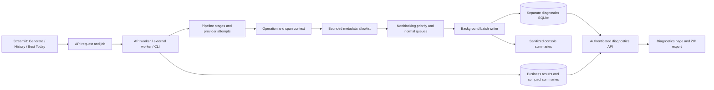

# Diagnostics: finding and reporting a problem

## For app users

1. Select **View diagnostics** on Generate, History or Best Today. You can also
   open **Diagnostics** directly from the sidebar.
2. Filter by date (UTC), sport, outcome or service, or paste a pick, slate or
   operation ID. Select **Refresh diagnostics** for the latest records.
3. Choose an operation. Read the summary, completeness notice, suggested next
   action and stage events. The summary has a copy button.
4. Select **Prepare diagnostic ZIP**, then **Download diagnostic ZIP**. Include
   that file when reporting a problem. Reports contain safe metadata, not prompts
   or provider responses. Team names, dates and operation IDs remain included.

The page refreshes manually and caches its current snapshot. Downloading a report
does not run the query again. If the API cannot be reached, **Download local failure
report** saves a smaller report that explicitly lacks backend evidence.

| Outcome | Meaning |
| --- | --- |
| `queued` / `running` | Waiting for execution or still processing; refresh before resubmitting. |
| `success` | The operation completed successfully. |
| `no_picks` | Analysis completed but no verified recommendations qualified. |
| `partial` | Results exist, but part of the work failed or remained incomplete. |
| `failed` | The operation could not complete; inspect the recorded cause. |

A polling timeout means the UI stopped waiting; the backend may still be running.
Old runs may have only a saved result. The Saints–Lions failure from September 11
cannot be diagnosed retrospectively because the collector discarded its exception.
This change preserves future causes without rewriting historical results.

## Architecture

`services/diagnostics.py` defines the shared storage interface, event policy,
operation context and SQLite adapter. `diagnostics_support.py` lets standalone
skill scripts use it. API routes and the Streamlit view remain separate consumers.

Each generation uses a canonical operation ID persisted on its business record.
Request, job, pick/slate and ledger IDs connect related records. Child slate
matches and resolution checks receive their own operation IDs and parent links.
Context is copied explicitly into provider thread pools. Stage spans record real
start/end timestamps and elapsed durations. Queue claims include attempts and
time since enqueue. Existing `success`/`failed` terminal polling statuses remain
compatible; the additional `outcome` field carries finer distinctions.

Instrumentation covers shared pipeline stages, provider attempts and retries,
NFL/MLB collection, discovery, availability, workers, CLI and outcome resolution.
Provider usage counts are recorded when the existing provider exposes them.
Counts and grouped rejection reasons explain missing inputs without retaining
raw offers in diagnostics. Validated picks and their evidence remain business data.

## Data and performance limits

| Control | Default |
| --- | --- |
| Detail / summary retention | 30 / 90 days |
| Logical SQLite storage budget | 128 MiB |
| Serialized event / events per operation | 8 KiB / 500 |
| Per-process queue capacity | 2,000 events, including 200 reserved critical slots |
| Batch / idle writer wakeup | Up to 100 events / 100 ms |
| Maintenance | About every 60 seconds, bounded deletion batches |
| SQLite busy timeout / attempts | 50 ms / two short attempts per batch |
| Normal diagnostic reads | 120 per minute per app key |
| Export and diagnostic writes | Combined 10 per minute per app key |
| Administrator debug window | Up to 15 minutes per operation |

The producer performs bounded metadata processing and enqueues without waiting
for disk or network access. A separate thread handles SQLite, retention and
console output. Successful health/status polls produce counters instead of
individual diagnostic operations. Reading diagnostics does not generate new
diagnostic events or consume the generation rate limit.

The storage budget covers allocated database pages in use. A batch can briefly
overshoot it; WAL files and filesystem allocation add overhead, so 128 MiB is not
a hard bound on physical disk use. Cleanup prunes older details before summaries.
Large expiry backlogs drain across maintenance cycles. Separate SQLite processes
must share the same local persistent filesystem. For multiple hosts, implement a
shared storage adapter instead of sharing SQLite over a network filesystem.

Delivery is best effort. Full queues, full/locked disks, event caps, retention and
process interruption can lose details. Health counters and completeness notices
make these limits visible. Reserved capacity prioritizes lifecycle/error events
but cannot guarantee delivery when that capacity is full. Compact business
summaries allow fallback when the diagnostic database is unavailable. A process
lease can identify interrupted recording, but cannot prove that a job failed.
Per-process counters persist periodically and at orderly shutdown; abrupt crashes
can lose the most recent counters and queued events.

## Privacy and access

The shared allowlist accepts identifiers, normalized matchup metadata, numeric
counts/timings, provider/model, error codes, exception/cause types and bounded code
frames. It discards raw prompts/responses, request bodies, HTML, arbitrary logging
objects, credentials, headers/cookies, URLs and traceback locals. Console
formatting and Sentry apply the same metadata policy. Legacy raw debug dumps have
been removed. The normal viewer, normal API and ZIP omit technical frames.

All app users sharing an API key can read sanitized diagnostics. There is no new
per-user tenancy model. Administrator endpoints additionally require
`X-Admin-API-Key` matching `COLMILLO_ADMIN_API_KEY`; never enter this key into an
ordinary report. Debug mode retains additional allowlisted DEBUG events for an
existing operation; it does not enable payload capture or replay an old query.

## Operator reference

| Endpoint | Purpose |
| --- | --- |
| `GET /diagnostics/operations` | Filtered listing; limit up to 100, offset pagination. |
| `GET /diagnostics/operations/{id}` | Summary and first 100 events. |
| `GET /diagnostics/operations/{id}/events` | Paginated events, up to 100 per page. |
| `GET /diagnostics/operations/{id}/export` | Sanitized ZIP snapshot, up to 500 events. |
| `GET /diagnostics/health` | Storage availability, retention and delivery counters. |
| `POST /diagnostics/ui-events` | Strict, rate-limited event vocabulary for an existing operation. |
| `GET /admin/diagnostics/operations/{id}` | Technical view including bounded frames. |
| `POST /admin/diagnostics/operations/{id}/debug` | Enable metadata-only DEBUG events for 15 minutes. |

All routes require `X-API-Key`; administrator routes require both keys. UI event
ingestion marks events as `untrusted_client` and cannot change the saved result.
The current UI provides local connection reports; the ingestion endpoint is also
available to future clients. HTTP responses include a validated `X-Request-Id`.

`COLMILLO_DIAGNOSTICS_DB_PATH` defaults to `diagnostics.db` beside
`COLMILLO_DB_PATH` (or beside `data/colmillo.db` if unset). Use the same explicit
path for API, CLI and worker if running them from different working directories.
Compose and Render place diagnostics on the existing `/var/data` volume.
Business and ledger paths retain their existing configuration; verify
`COLMILLO_RUNS_DB_PATH` points to persistent storage too. Back up existing ledgers
before relocating them; migrations do not move historical files.

`COLMILLO_DIAGNOSTICS_ENABLED=0` disables detailed collection while retaining
terminal summaries. `COLMILLO_DIAGNOSTICS_CONSOLE=0` disables diagnostic console
summaries. CLI summaries go to stderr to preserve report output on stdout.
Neither switch changes the business pipeline. New nullable business
columns and ledger columns are added automatically by existing initialization.
`COLMILLO_VERSION` and `COLMILLO_COMMIT` identify the build in new operations;
unset local builds are labelled `0.0.0-dev` and `unknown`.

After deployment, confirm persistent paths, inspect `/diagnostics/health`, generate
one real query and verify that its ID, stages and download appear in the UI.
Watch dropped-event/storage counters and measure overhead under actual traffic.
See the [progress checklist](diagnostics-implementation-plan.md) and
[local validation record](diagnostics-validation.md). **Create the PR next.**
