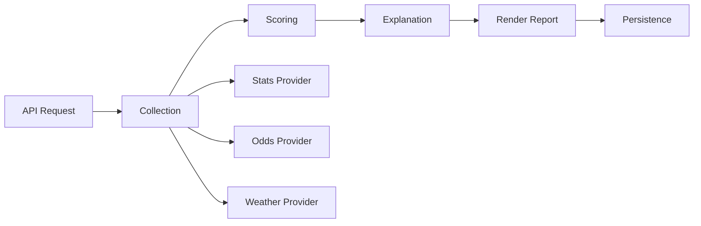

# MLB Architecture

## Data Flow (Pipeline)



### Pipeline stages

1. **Collection** — Gathers player stats, odds lines, weather, and lineup data from configured providers
2. **Scoring** — Deterministic config-driven engine evaluates each player×market combination
3. **Explanation** — Generates natural-language rationale (deterministic fallback or LLM)
4. **Render** — Produces markdown report with picks table, NO-BET section, and disclaimers
5. **Persistence** — Stores request, trace, and report in SQLite via the run ledger

## Provider Setup

The MLB module uses placeholder data by default. To wire real providers, set environment variables per provider type:

| Provider Type | Env Var | Description |
|---------------|---------|-------------|
| Stats | `MLB_STATS_PROVIDER` | Player season/recent stats source |
| Odds | `MLB_ODDS_PROVIDER` | Lines from sportsbook APIs |
| Weather | `MLB_WEATHER_PROVIDER` | Game-time weather for park factors |

### Cache TTL Configuration

Each provider response is cached to reduce API calls and improve latency:

| Provider | Default TTL | Notes |
|----------|-------------|-------|
| Stats | 6 hours | Season stats refresh overnight |
| Odds | 15 minutes | Lines move frequently pre-game |
| Weather | 1 hour | Conditions stable within window |

Cache decisions (hit/miss/expired) are logged per request for observability.

## Scoring Factor Model

The scoring engine (`baseball_scoring.py`) evaluates players across weighted factors:

- **Rate stats** — hits/game, HR/game, K/game (season + last-5 trending)
- **Matchup** — Batter handedness vs. pitcher handedness advantage
- **Park/weather** — Park factor, HR factor, temperature, wind direction
- **Vegas context** — Team implied total, batting order position
- **Market agreement** — Alignment between model projection and line

Factors are combined via configurable weights (no ML model dependency).

## NO-BET Guardrail Rules

A pick receives NO-BET designation when:

- Combined confidence score falls below the configured threshold
- Data freshness gate fails (stale provider data)
- Insufficient factor coverage (missing key inputs)
- LLM cannot preserve the scorer's designation (guardrail enforced)

NO-BET picks appear in a separate report section with the triggering reason.

## Trace Schema

Every pipeline run produces a trace record (`baseball_trace.py: MLBTraceRecord`) containing:

- `trace_id`, `run_id` — Correlation identifiers
- `sport`, `league` — Always "baseball"/"mlb"
- `provider_statuses` — Per-provider outcome (ok/error/cached)
- `input_hash` — SHA256 of collected inputs (reproducibility check)
- `scorer_version`, `scorer_config_hash` — Engine versioning
- `explanation` — Generated rationale text
- `risk_flags` — Any warnings surfaced
- `no_guarantee_flag` — Always true (responsible gaming)
- `created_at_utc` — Timestamp

## Sport-Agnostic Core vs. MLB-Specific Layer

```
services/api/main.py          ← Sport-agnostic dispatcher
  ↓ delegates to
BaseballModule                 ← MLB-specific orchestration
  ├─ baseball_scoring.py      ← MLB scoring factors
  ├─ baseball_explainer.py    ← MLB explanations + hallucination guard
  ├─ baseball_logging.py      ← MLB structured logging
  ├─ baseball_trace.py        ← MLB trace schema
  ├─ mlb_settlement.py        ← Settlement grading (win/loss/push/void)
  └─ render_baseball_report.py ← MLB report with responsible gaming
```

The API pipeline (`_run_sport_module_pipeline`) dispatches to the correct module based on the `sport` field in the request. Adding a new sport requires implementing the `SportModule` protocol.
