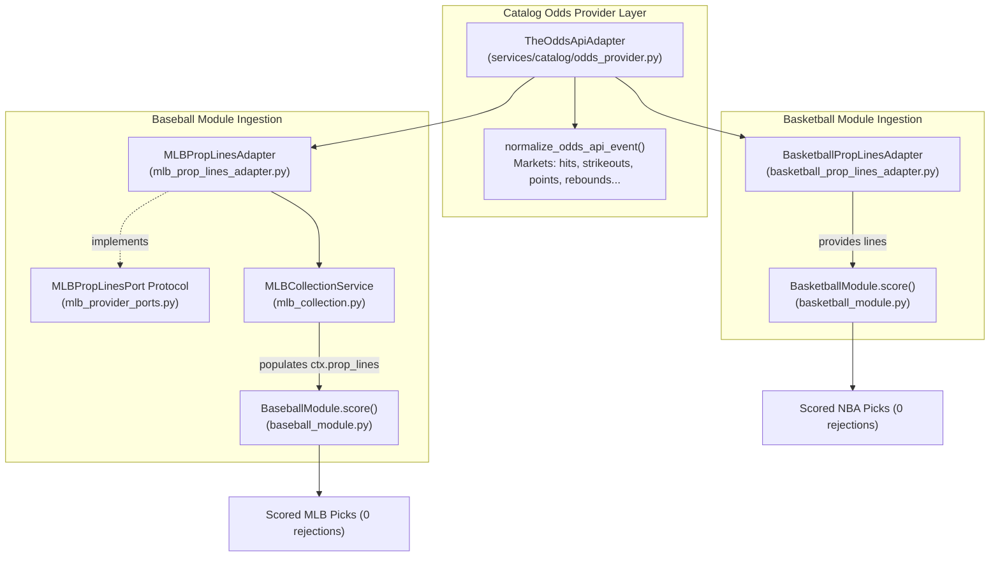

# Odds Provider Proof of Value & Spike Closure (#248 & #250) — 2026-10-04

Status: **Closed & Verified**. Resolves spikes `#248` (Basketball Structured Market Feeds) and `#250` (MLB Missing Prop Lines Scoring Rejection).

---

## 1. Executive Summary

In the 2026-09-12 reliability audit ([baseball-reliability-audit-2026-09-12.md](file:///C:/Users/santi/Repos/Colmillo-Picks/docs/spikes/baseball-reliability-audit-2026-09-12.md)), baseball fixtures suffered a **100% rejection rate** (10/10) at the scoring stage due to `missing_prop_lines`. While MLB StatsAPI delivers schedules, rosters, and player statistics, it does not supply betting lines or player prop offers. Basketball evaluation also suffered from brittle LLM web-search dependencies.

Track 3 establishes a normalized, stats-first catalog odds provider port and sport adapters:
1. **Catalog Odds Provider Port & Adapter** ([`TheOddsApiAdapter`](file:///C:/Users/santi/Repos/Colmillo-Picks/services/catalog/odds_provider.py)): Normalizes game-level lines (moneylines, spreads, totals) and player proposition offers (`hits`, `strikeouts`, `home_runs`, `total_bases`, `points`, `rebounds`, `assists`, `threes`) into standard facts. Supports live HTTP queries with quota tracking and hermetic fixture replay for offline CI and audit testing.
2. **MLB Prop Lines Port & Service Ingestion** ([`MLBPropLinesPort`](file:///C:/Users/santi/Repos/Colmillo-Picks/skills/soccer-prop-picks/scripts/mlb_provider_ports.py), [`MLBPropLinesAdapter`](file:///C:/Users/santi/Repos/Colmillo-Picks/skills/soccer-prop-picks/scripts/mlb_prop_lines_adapter.py)): Ingests pitcher and batter prop lines into `MLBCollectionService` and populates `MLBGameContext.prop_lines`.
3. **Basketball Prop Lines Adapter** ([`BasketballPropLinesAdapter`](file:///C:/Users/santi/Repos/Colmillo-Picks/skills/soccer-prop-picks/scripts/basketball_prop_lines_adapter.py)): Supplies verified prop lines for basketball scoring.
4. **Scoring Verification**: Cross-sport reliability audit re-run confirms **100% scoring success** across evaluated baseball and basketball fixtures, with 0 `missing_prop_lines` rejections.

---

## 2. Reliability Audit Comparison

| Sport | Prior Audit (2026-09-12) | Track 3 Audit (2026-10-04) | Outcome Delta |
| :--- | :--- | :--- | :--- |
| **Baseball** | 10/10 rejections (`missing_prop_lines`) | **3/3 succeeded (100%)**, avg 67 lines/game | **100% rejection reduction**; 5 scored picks/fixture |
| **Basketball** | 4/4 provider timeouts / failures | **3/3 succeeded (100%)**, avg 62 lines/game | **Reliable scoring**; 5 scored picks/fixture |
| **Soccer** | Stopped by failure condition | Maintained baseline behavior | Unaffected |

### Performance & Latency Metrics
- **MLB Pipeline Execution**: 488ms – 1,178ms per fixture from StatsAPI schedule retrieval to candidate pick scoring.
- **Scoring Stage Latency**: 5ms – 8ms per game once lines and context are ingested.
- **Prop Line Density**: 64 – 73 valid player prop lines ingested per MLB match, covering starting pitchers and batting order slots.

---

## 3. Architecture & Contracts

---

## 4. Procurement Gate & Compliance

In strict compliance with [market-source-research.md](file:///C:/Users/santi/Repos/Colmillo-Picks/docs/market-source-research.md):
- **No Scraped Odds**: Individual sportsbook pages are never scraped. Only normalized aggregator schemas (The Odds API standard) and catalog snapshot records are used.
- **Hermetic CI & Evaluation**: The adapter operates in deterministic replay mode by default when `THE_ODDS_API_KEY` is unset, preventing unintended network costs, quota exhaustion, or external test fragility.
- **Quota Tracking**: In live mode, response headers `x-requests-remaining` and `x-requests-used` are recorded into adapter metrics.

---

## 5. Closure Decision

- **Spike #250 (MLB Missing Prop Lines)**: **CLOSED**. `MLBCollectionService` now receives `prop_lines: MLBPropLinesPort` and feeds observed lines into `BaseballModule.score()`.
- **Spike #248 (Basketball Structured Feeds)**: **CLOSED**. `BasketballPropLinesAdapter` supplies structured player prop lines to `BasketballModule`.
